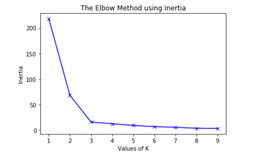

<h1 align="center">Finding Optimum Number of Clusters in a given Dataset </h1>

  
 Here we use K-Means method for creating clusters for the given dataset.The main part of k-means is determining the  
    numer of clusters in the dataset. 
    For Finding out number of clusters,the method we use is called "elbow method".For understanding this we must know what is <b> Inertia </b> 
    and <b> Distortion </b> 
.
    <ol>
    <li> <b>Distortion</b> : It is calculated as the average of the squared distances from the cluster centers of the respective clusters. Typically, the Euclidean distance metric is used  </li>  
  <li> <b>Inertia </b> : It is the sum of squared distances of samples to their closest cluster center. </li>  .
  
  

  <h2> Finding out the number of clusters </h2>
   
 
 
 <b>To determine the optimal number of clusters, we have to select the value of k at the “elbow” ie the point after which the distortion/inertia start decreasing in a linear fashion. Thus for the given data, we conclude that the optimal number of clusters for the data is 3.</b>

 

  
 

  <h2> Modules Used </h2>
  <ol>
    
    1.Pandas
    2.Numpy
    3.Sckit-Learn
    4.MatplotLib
    
   </ol>
   

   <ol>
   <h2> Dataset Used </h2>
  <l1> Iris Dataset :  https://bit.ly/3kXTdox </l1>
      
      
